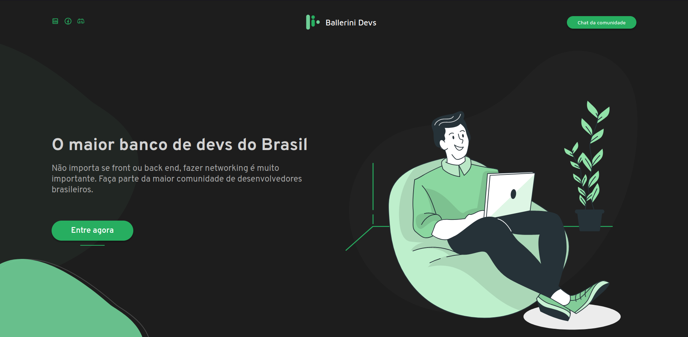
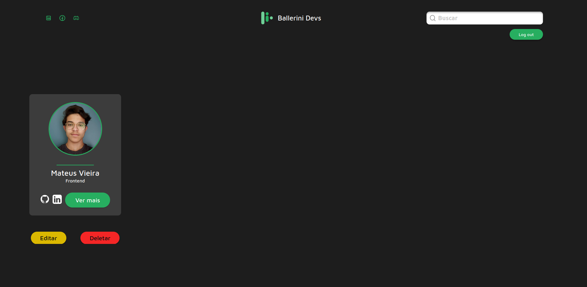

<header>
    <h1 align="center">Ballerini Devs</h1>
</header>
 
<main>
    

        <h2>📑 Pages</h2>
        

            <h2>Landing Page</h2>
            
            <h2>Devs Page</h2>
            
            <h2>Chat Page</h2>
            
        

    

     
    

        <h2>💻 Technologies</h2>
        <ul>
            <li><a target="_blank" rel="noreferrer" href="https://firebase.google.com/">Firebase</a></li>
            <ul>
                <li>Authentication</li>
                <li>Cloud Firestore</li>
                <li>Realtime Database</li>
                <li>Firebase Storage</li>
                <li>Hosting</li>
            </ul>
            <li><a target="_blank" rel="noreferrer" href="https://reactjs.org/">React.js</a></li>
            <li>Packages:</li>
            <ul>
                <li><a target="_blank" rel="noreferrer" href="https://react-select.com/home">React Select</a></li>
                <li><a target="_blank" rel="noreferrer" href="https://www.npmjs.com/package/react-scrollable-feed">React
                        Scrollable Feed</a></li>
                <li><a target="_blank" rel="noreferrer" href="https://react-hot-toast.com/">React Hot Toast</a></li>
                <li><a target="_blank" rel="noreferrer" href="https://www.npmjs.com/package/emoji-picker-react">Emoji
                        Picker React</a></li>
                <li><a target="_blank" rel="noreferrer" href="https://swiperjs.com/">Swiper</a></li>
                <li><a target="_blank" rel="noreferrer" href="https://www.npmjs.com/package/uuid">UUID</a></li>
            </ul>
            <li><a target="_blank" rel="noreferrer" href="https://www.typescriptlang.org/">Typescript</a></li>
            <li><a target="_blank" rel="noreferrer" href="https://sass-lang.com/">Sass</a></li>
        </ul>
    

     
    

        <h2>✏️ Project</h2>
        
Ballerini Devs was a challenge proposed by the Ballerini Community. The project consists of reproducing the
            Figma design and adding some features to deal with the devs like adding, removing and editing dev cards.

    

     
    

        <h2>✨ Extra</h2>
        
To improve the proposed challenge, I add a backend with Firebase to store the developers' data. Also, I
            create a new chat page using authentication and real-time database so the community can conversate. Finally, I
            adjust the design to be responsive

        <ul>
            <li>Responsive</li>
            <li>Backend (Firebase)</li>
            <li>Chat Page</li>
        </ul>
    

     
    

        <h2>📱 Compatibility</h2>
        <ul>
            <li>Browser (Web)</li>
            <ul>
                <li>Desktop</li>
                <li>Mobile</li>
            </ul>
        </ul>
    

     
    

        <h2>🎨 Figma</h2>
        <a target="_blank" rel="noreferrer"
            href="https://www.figma.com/file/FX14O2BvLp8UEbXrSkdcUc/Ballerini-Devs?node-id=1763%3A20">Designed by the
            Ballerini Community</a>
    

     
    

        

        
Proposed by the <a target="_blank" rel="noreferrer" href="http://discord.gg/ballerini">Ballerini
                Community</a>

        
Developed by <a target="_blank" rel="noreferrer" href="https://www.linkedin.com/in/mateusvrs/">Mateus
                Vieira</a> 💛

    

</main>